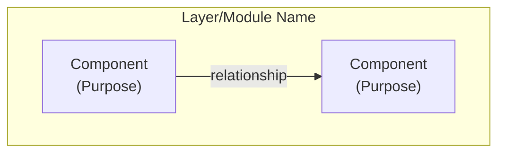

# Working with Architecture Diagrams

**Goal:** Concise, AI-optimized visual documentation. Diagrams show "what connects to what", Data Flows show "what happens when".

## Documentation Decision Matrix

| Need to Show | Use This | Format | Example |
|-------------|----------|--------|---------|
| **System relationships** | Mermaid Diagram | Graph with nodes + edges | "Service A calls Service B" |
| **Operation sequences** | Data Flow (text) | Method chains | `init()` → `load()` → `run()` |
| **Architectural rationale** | DESIGN_FAQ | Q&A with trade-offs | "Why microservices?" |
| **Usage patterns** | DX_FAQ (Memory Palace) | Rooms + code snippets | "How to initialize?" |
| **Implementation details** | Code comments | Inline comments | Edge cases, gotchas |

**Quick Decision:** "X connects to Y managing Z" → Diagram. "Why X exists" → DESIGN_FAQ. "How to use X" → DX_FAQ.

## Diagram Structure (Standard Template)

```markdown
# [System Name] Architecture Diagram



## Key Data Flow

### [Operation Category]

**[Specific Operation]:**
`Method1()` → `Method2()` → `Method3()` → outcome

**Details:** Additional context if needed
```

## Creating Diagrams - Quick Workflow

| Step | Action | Key Points |
|------|--------|------------|
| **1. Identify Scope** | What to cover | System boundaries, core vs auxiliary |
| **2. Map Components** | Classes, services, modules | Nodes in the graph |
| **3. Map Relationships** | How components connect | Edges with labels |
| **4. Group Logically** | Create subgraphs | Related components together |
| **5. Style** | Apply colors | Consistent colors per type |
| **6. Document Flows** | Text-based method chains | Key operations only |

**Fast Pattern:** Identify → Map → Group → Style → Document

## Mermaid Syntax - Memory Palace 🏛️

**Spatial Memory:** Remember Mermaid syntax by location in a "construction site"

### 🏗️ Foundation (Basic Structure)

```mermaid
graph TB                           # Top-to-bottom flow (also: LR, RL, BT)
    subgraph "Group Name"          # Logical grouping
        Node["Label<br/>(Desc)"]   # Node with description
    end
```

### 🔗 Connections (Relationships)

| Connection | Symbol | Use For |
|-----------|--------|---------|
| **Solid** | `-->` | Direct relationships |
| **Dotted** | `-.->` | Implements/extends |
| **Labeled** | `--\|label\|-->` | Named relationships |

**Common Labels:** `manages`, `uses`, `provides`, `calls`, `stores`, `creates`, `extends`

### 🎨 Decoration (Styling)

```mermaid
style NodeId fill:#e1f5ff         # Light blue for core
style NodeId fill:#fff4e1         # Light yellow for data
style NodeId fill:#e8f5e9         # Light green for utilities
```

### ⚠️ Safety Rules (Quoting)

**Always quote labels with:**
- Spaces: `"Node Label"`
- Special chars: `"Method() Call"`, `"API: /path"`
- Line breaks: `"First<br/>Second"`

**Node IDs:** PascalCase, no spaces, descriptive

## Common Patterns - Quick Templates 📐

### Registry Pattern
```mermaid
subgraph "Registry System"
    Registry["Registry<br/>(Type → Value)"]
    Registry -->|stores| Data["Data<br/>(Storage)"]
    Registry -->|creates| Factory["Factory<br/>(Constructor)"]
end
```

### Layered Architecture
```mermaid
subgraph "API Layer"
    API["API<br/>(Public Interface)"]
end
subgraph "Business Layer"
    Service["Service<br/>(Logic)"]
end
subgraph "Data Layer"
    Storage["Storage<br/>(Persistence)"]
end
API -->|calls| Service
Service -->|uses| Storage
```

### Command Pattern
```mermaid
subgraph "Command System"
    Interface["Interface<br/>(API)"]
    Interface -->|pushes| Queue["Queue<br/>(Deferred)"]
    Queue -->|executes| Handler["Handler<br/>(Processor)"]
end
```

### Extension Pattern
```mermaid
Base["Base<br/>(Core)"]
Extension["Extension<br/>(Add-ons)"]
Base -.->|extends| Extension
Extension -->|provides| Methods["Methods<br/>(API)"]
```

**Usage:** Copy template → Adapt labels → Add specific relationships

## Data Flow Patterns 🌊

| Pattern | Format | Example |
|---------|--------|---------|
| **Simple Flow** | `A()` → `B()` → `C()` | `init()` → `load()` → `start()` |
| **Conditional** | `A()` → check → if true: `B()` | `process()` → validate → if valid: `save()` |
| **Branching** | `A()` → branches:<br/>- Path 1: `B1()`<br/>- Path 2: `B2()` | `request()` → route:<br/>- GET: `fetch()`<br/>- POST: `create()` |
| **Batch** | `Batch()` → `A()` (each) → `B()` (all) | `processAll()` → `validate()` (each) → `commit()` (batch) |
| **Cached** | `Query()` → cache check → hit: return / miss: `Compute()` | `getData()` → check → hit: cached / miss: `fetchAPI()` |

**Format:** Use `→` for flow, keep concise, document key operations only.

## Update Workflow - Quick Reference

### Update Trigger Matrix

| Code Change | Update Diagram? | Update Data Flow? |
|-------------|----------------|-------------------|
| New component/class | ✅ Add node | ✅ If public API |
| Relationship change | ✅ Update edge | ✅ If flow affected |
| Method rename | ❌ | ✅ Update method names |
| Refactor (same API) | ❌ | ❌ |
| New feature | ✅ Add subgraph | ✅ Document flow |
| Internal optimization | ❌ | ❌ (maybe ✅ if flow changes) |

### Update Process (Compressed)

**1. Identify Change:**
- Use `Grep` to find diagram mentions of changed components
- Check which subgraphs are affected

**2. Update Mermaid Graph:**
- **New node:** Add to relevant subgraph with description
- **New relationship:** Add labeled edge
- **Changed relationship:** Update edge label
- **New system:** Add new subgraph

**3. Update Data Flows:**
- Find affected flow sections
- Update method names and chains
- Add new flows for new operations

**4. Validate:**
- Check Mermaid syntax (rendering)
- Verify method names match code
- Ensure all nodes in flows exist in graph

## Validation Checklist

Before committing diagram updates:

- [ ] Mermaid syntax valid (renders without errors)?
- [ ] All nodes have descriptive labels?
- [ ] All relationships labeled appropriately?
- [ ] Data flows match actual code?
- [ ] Method names current?
- [ ] Styling consistent?
- [ ] No orphaned nodes?
- [ ] Subgraphs logically grouped?

## Quick Reference

| Task | Action |
|------|--------|
| **Find diagram** | Use `Glob "**/architecture*.md"` or `"**/*_diagram.md"` |
| **Create diagram** | Map components → Group → Connect → Style → Document flows |
| **Update after change** | Use trigger matrix → Update graph + flows → Validate |
| **Add relationship** | `Node1 --\|label\|-->Node2` with descriptive label |
| **Add data flow** | `Method1()` → `Method2()` → outcome (concise chains) |
| **Verify syntax** | Check rendering, quote labels with spaces/special chars |

## Related Resources

Check for project-specific resources:
- Mermaid syntax rules: `.cursor/rules/mermaid_*.mdc` or Mermaid docs
- Update diagram commands: `.cursor/commands/update-diagram.*` or `.cursor/commands/*diagram*`
- Example diagrams: Look for `*architecture*.md` or `*_diagram.md` files
- Mermaid documentation: https://mermaid.js.org/

**Pattern:** Use `Glob` to discover existing diagrams, adapt their style for consistency.
