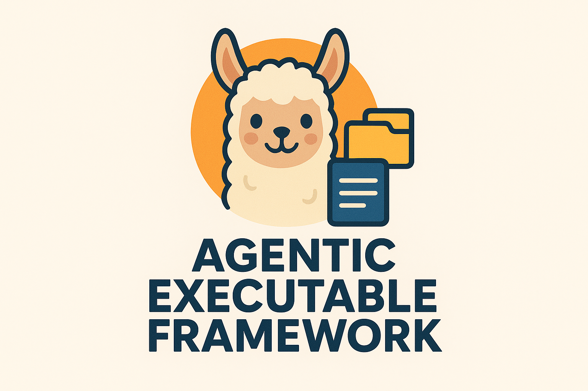
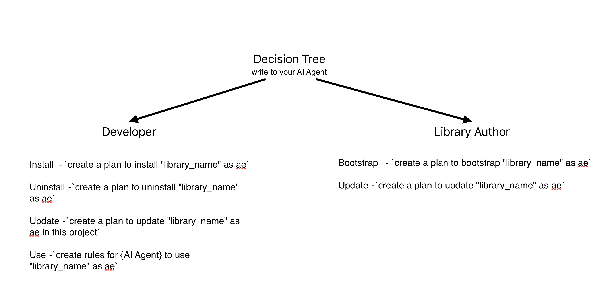

<div align="center">

# Agentic Executables (AE) + MCP Server

_Reinventing library management for AI agents_

[](LICENSE)

</div>

<p align="center">
  
</p>

Can you imagine you can install / configure and uninstall libraries (in any language and framework) as easy as any app or game on your phone or computer?

<p align="center">
  
</p>

This is the framework-agnostic approach enabling AI agents to autonomously manage library installation, configuration, and usage across any programming language.

## What is AE?

Agentic Executables treat libraries as executable programs with structured, agent-readable instructions. Instead of relying on human documentation, AI agents follow standardized `.md` files to install, configure, integrate, update, and uninstall libraries autonomously.

## Quick Start

### You are Developer:

1. First you need to install MCP server.
   To do this, please drop https://github.com/fluent-meaning-symbiotic/agentic_executables/blob/main/agentic_executables_mcp/ae_install.md file to your AI Agent or install it manually.

2. Second, use it:

- to install library (make sure it is in registry) write to your AI Agent: `create a plan to instal "library_name" as ae`
- to uninstall - `create a plan to uninstall "library_name" as ae`
- to update - `create a plan to update "library_name" as ae`
- to use - `create rules for {AI Agent} to use "library_name" as ae`

That's it:)

### You are Library Author | Maintainer:

1. First you need to install MCP server.
   To do this, please drop https://github.com/fluent-meaning-symbiotic/agentic_executables/blob/main/agentic_executables_mcp/ae_install.md file to your AI Agent or install it manually.

2. Second, use it:

- to bootstrap / update - `create a plan to bootstrap / update "library_name" as ae`
- to submit to registry - `create a plan to submit "library_name" to registry as ae`

That's it:)

Please note: the documentation still in progress, so if you have any questions, please ask in discord or github issues.

## Community:

Discuss in discord server https://discord.gg/y54DpJwmAn or share your ideas and feedback in github issues!

## Repository Structure

### 1. Framework Core → [`prompts_framework/`](./prompts_framework/)

Foundation documents defining AE principles and methodology:

- **`ae_context.md`** - Core definitions and principles
- **`ae_bootstrap.md`** - Guide for creating AE files
- **`ae_use.md`** - Guide for using AE files

### 2. MCP Server → [`agentic_executables_mcp/`](./agentic_executables_mcp/)

Model Context Protocol server providing strategic guidance for AI agents:

- 5 core tools: definition, instructions, verification, evaluation, registry management
- Language-agnostic guidance for AE operations
- Docker deployment ready

[**Full Documentation →**](./agentic_executables_mcp/README.md)

### 3. Library Registry → [`ae_use_registry/`](./ae_use_registry/)

Centralized repository of AE-enabled libraries:

- Curated library-specific AE files
- Standardized naming: `<language>_<library_name>`
- Direct fetch via MCP tools or manual download

[**Contributing Guide →**](./ae_use_registry/CONTRIBUTING.md)

[**Full Bootstrap Guide →**](./prompts_framework/ae_bootstrap.md)

### For Developers

**With AI Agent + MCP Server:**

```
Agent → MCP: get_from_registry(library_id: "python_requests", action: "install")
Agent → Executes installation automatically
```

**Manual:**

1. Browse [`ae_use_registry/`](./ae_use_registry/) for your library
2. Download relevant `.md` files
3. Provide to AI agent for execution

[**Installation Guide →**](./agentic_executables_mcp/ae_install.md)

## Core Principles

- **Agent Empowerment** - AI agents work autonomously without human intervention
- **Modularity** - Clear, reusable instruction steps
- **Contextual Awareness** - Sufficient domain knowledge embedded
- **Reversibility** - Clean uninstallation restores original state
- **Validation** - Built-in verification steps
- **Language Agnostic** - Works across all ecosystems

## Workflow Overview

```
Library Author                  Registry                   Developer
      │                            │                           │
      ├─► Create AE files          │                           │
      ├─► Submit to registry ─────►│                           │
      │                            │◄───── Fetch AE files ─────┤
      │                            │                           │
      │                            │                   AI Agent executes
      │                            │                   installation
```

<p align="center">
  
</p>

<p align="center">
  
</p>

## Resources

- **MCP Server Setup**: [`agentic_executables_mcp/README.md`](./agentic_executables_mcp/README.md)
- **Registry Contribution**: [`ae_use_registry/CONTRIBUTING.md`](./ae_use_registry/CONTRIBUTING.md)
- **Example Libraries**: [`ae_use_registry/dart_xsoulspace_lints/`](./ae_use_registry/dart_xsoulspace_lints/), [`ae_use_registry/python_requests/`](./ae_use_registry/python_requests/)
- **Framework Principles**: [`prompts_framework/ae_context.md`](./prompts_framework/ae_context.md)

## License

MIT License - Made by [@arenukvern](https://github.com/arenukvern)

## Support

- Issues: [GitHub Issues](https://github.com/fluent-meaning-symbiotic/agentic_executables/issues)
- Registry URL: https://github.com/fluent-meaning-symbiotic/agentic_executables
