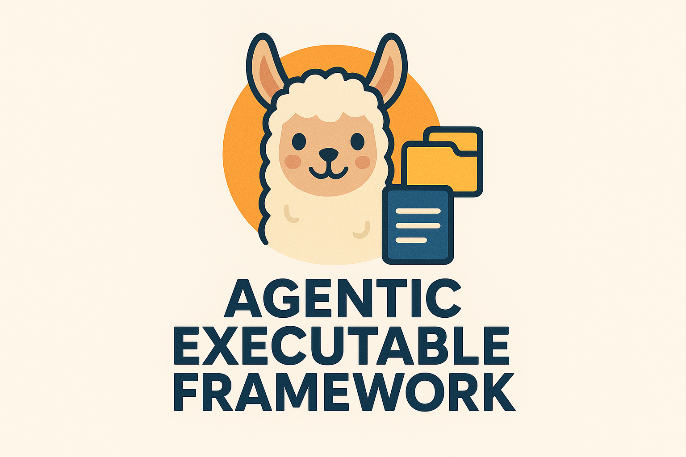

```
   ___   ____
  / _ | / __/
 / __ |/ _/
/_/ |_/___/  Agentic Executables
```

**Define once. Reuse anywhere.**

**Turn domain knowledge into executable instructions.** Humans and AI agents run the same deterministic commands.

<!-- badges -->

[](LICENSE)
[](https://discord.gg/y54DpJwmAn)
[](https://deepwiki.com/fluent-meaning-symbiotic/agentic_executables)

> **AE v3.x** is here. See [`docs_site/docs/ae-3-overview.md`](docs_site/docs/ae-3-overview.md) for the architecture overview and [`plugins/claude-code-ae-plugin/`](plugins/claude-code-ae-plugin/) for the Claude Code integration. (will be expanded to include Cursor and Codex integrations soon)

## North Star

**Make any specification verifiable against any implementation.**

Every team using AI coding agents watches specs rot against code within
weeks. AE exists so that docs and code hold each other honest — in both
directions, across languages, forever.

Concretely, we win when:

1. **Any spec format is eligible.** GitHub Spec Kit specs, ADRs, plain
   structured markdown import deterministically into a canonical pack
   (`ae canonical import-spec`). No re-authoring, no LLM gate.
2. **Any language realization is checkable.** One canonical, many
   implementations; drift surfaces as tier-classified gaps
   (`ae artifact verify`, `ae status`) instead of silent rot.
3. **Agents are first-class consumers.** Every canonical speaks native
   agent dialect (CLI / MCP / skills); AE never owns a model.
4. **Verified knowledge is shareable.** Canonical packs live in an open
   registry ([agentic_executables_registry](https://github.com/fluent-meaning-symbiotic/agentic_executables_registry))
   so patterns become standards others can install, not private notes.

See the [60-second multi-language demo](examples/multi_language_kv/) for
the whole story in one command.

## Status

AE v3.x is in beta. The core functionality is stable, but the API is subject to change.

## What is AE?

AE is an open framework that extracts domain knowledge and turns it into executable lifecycle instructions. It works for libraries, apps, games, servers — any implementation. Humans and AI agents share the same deterministic workflows.

Think of AE like a USB-C port for project knowledge. Just as USB-C provides a standardized way to connect devices, AE provides a standardized way to connect domain knowledge to executable workflows.

<p align="center">
  
</p>

## What can AE do?

- **Import existing specs** (Spec Kit, ADRs, markdown) into verifiable canonical packs — deterministic, no LLM (`ae canonical import-spec`)
- **Distill knowledge from any public repo, in any language** — `ae canonical distill --repo <url>` shallow-clones, ingests via the best extractor (generic fallback for unknown languages), and emits a delegation task for your coding agent
- **Extract structural inventories** from Dart / Rust / Kotlin-Swift codebases via heuristic extractors (`ae init`); unknown languages distill through the code-agnostic path
- **Link realizations to specs** and materialize per-feature evidence matrices (`ae artifact link`)
- **Surface drift as tiered gaps**: invariant violations, upstream blockers, partial features (`ae artifact verify`, `ae status`)
- **Enforce evidence, not claims**: `ae artifact mark-evidence` records test provenance; `verify --run-tests` executes the recorded commands and catches packs lying about their own tests
- **Delegate enrichment to any coding agent** — AE never calls a model: it emits delegation instructions (task JSON + prompt), you or your agent do the work, AE validates and merges with strict ID stability (`ae canonical distill`)
- **Store everything local-first** in `.ae_hub/`, with an open public registry for sharing canonical packs

## The Core Loop

```text
spec ──import──▶ canonical pack ──link──▶ artifact packs (any language)
                      ▲                          │
                      └────verify + status ◀─────┘
                 gaps surface as tiers; agents close them;
                 executed test evidence flows back into the matrix
```

Try it now: [`examples/multi_language_kv/run_demo.sh`](examples/multi_language_kv/run_demo.sh) — one canonical, two language implementations, gaps surfacing in ~10 seconds.

AE dogfoods itself: all three Dart packages are distilled into verified canonicals (`ae-core`, `ae-cli2`, `ae-mcp`) living in `.ae_hub/canonical/`, Tier-1 clean with executed test evidence. The tool verifies its own architecture.

## Quick Start

```bash
curl -fsSL https://raw.githubusercontent.com/fluent-meaning-symbiotic/agentic_executables/main/install.sh | bash
```

### Verify a spec against code (AE 3.x core loop)

```bash
ae hub init --project
ae init                                                  # extract packages -> artifacts

# Start from an existing spec...
ae canonical import-spec --from spec.md --concept my-spec
# ...or from code (any language, even a public repo):
ae canonical scaffold --concept mine --title "Mine" --from-artifact <pack>
ae canonical distill --repo https://github.com/org/repo --concept mine

ae artifact link --pack <pack> --canonical mine          # attach realization to contract
ae artifact verify --pack <pack> --run-tests             # tiered gaps + executed evidence
ae status                                                # project-wide cockpit
```

### Knowledge packs (v2 carry-over)

```bash
ae hub init
ae know build --url https://modelcontextprotocol.io/llms-full.txt --name mcp
ae know show --name mcp                                          # read and implement directly
ae generate --library-id my_sdk --library-root . --know mcp      # generate lifecycle files
ae registry get --library-id python_requests --action install     # or just manage a project
```

Source fallback:

```bash
cd agentic_executables_cli && dart pub get && dart run bin/ae.dart definition
```

## Commands

| Command                             | What it does                                                                                                                          |
| ----------------------------------- | ------------------------------------------------------------------------------------------------------------------------------------- |
| `ae hub init`                       | Create local-first hub                                                                                                                |
| `ae hub status`                     | Show hub artifacts and config                                                                                                         |
| `ae hub pull`                       | Pull from remote registry                                                                                                             |
| `ae hub push`                       | Generate push instructions                                                                                                            |
| `ae know build`                     | Extract knowledge from URL, repo, or file (supports PDF via `--format pdf` or auto; `--on-conflict reuse\|update\|fail\|new_version`) |
| `ae know list`                      | List stored knowledge packs                                                                                                           |
| `ae know show`                      | Display knowledge pack content                                                                                                        |
| `ae know diff`                      | Compare two knowledge versions                                                                                                        |
| `ae know update`                    | Re-fetch from source                                                                                                                  |
| `ae know migrate`                   | Migrate legacy name-keyed packs to canonical layout (source-id + aliases)                                                             |
| `ae generate`                       | Generate ae_use lifecycle files                                                                                                       |
| `ae instructions`                   | Get context-appropriate guidance                                                                                                      |
| `ae registry get --library-id <id>` | Fetch from remote registry                                                                                                            |
| `ae registry submit`                | Submit to registry                                                                                                                    |
| `ae package resolve`                | Produce deployment JSON (optional)                                                                                                    |
| `ae package validate`               | Validate package instructions                                                                                                         |
| `ae verify`                         | Verify implementation checklist                                                                                                       |
| `ae evaluate`                       | Evaluate AE compliance                                                                                                                |
| `ae doctor`                         | Preflight environment checks                                                                                                          |
| `ae definition`                     | Framework definition                                                                                                                  |
| `ae skill install [--upgrade]`      | Install AE skill template                                                                                                             |

## MCP Tools

| Tool              | Purpose                                       |
| ----------------- | --------------------------------------------- |
| `ae_definition`   | Framework definition                          |
| `ae_instructions` | Context guidance (supports `--know`)          |
| `ae_generate`     | Lifecycle file generation (supports `--know`) |
| `ae_registry`     | Registry operations                           |
| `ae_hub`          | Hub management                                |
| `ae_know`         | Knowledge extraction                          |
| `ae_verify`       | Implementation verification                   |
| `ae_evaluate`     | Compliance evaluation                         |

## Architecture

| Package                     | Role                                          |
| --------------------------- | --------------------------------------------- |
| `agentic_executables_core/` | Typed business logic, ports, adapters         |
| `agentic_executables_cli/`  | `ae` CLI (JSON-first, `--human` for readable) |
| `agentic_executables_mcp/`  | MCP v3 adapter                                |
| `docs_site/`                | VitePress docs with `/llms.txt` output        |

## Ecosystem

AE works with any AI agent or IDE that supports MCP: Claude, Cursor, VS Code Copilot, Codex, and more.

Machine-readable docs are published at `/llms.txt` and `/llms-full.txt` for direct agent consumption.

## Links

- [Docs Site](https://github.com/fluent-meaning-symbiotic/agentic_executables/tree/main/docs_site)
- [Registry](https://github.com/fluent-meaning-symbiotic/agentic_executables_registry)
- [Error Code Playbook](docs/error_code_playbook.md)
- [Architecture Diagram](docs/architecture_diagram.md)
- [Discord](https://discord.gg/y54DpJwmAn)

## Testing

```bash
cd agentic_executables_core && dart test
cd ../agentic_executables_cli && dart test
cd ../agentic_executables_mcp && dart test
```

## Star History

[](https://www.star-history.com/#fluent-meaning-symbiotic/agentic_executables&Date)

## License

[MIT](LICENSE)
