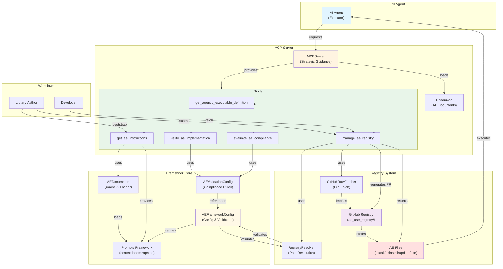

# Agentic Executables Architecture Diagram

## Key Data Flow

### Library Author Workflow
**Bootstrap**: `Author` → `get_ae_instructions(library, bootstrap)` → `AEDocuments.getDocuments()` → `loads ae_bootstrap.md + ae_context.md` → `creates AE files` → `verify_ae_implementation()` → `evaluate_ae_compliance()` → `manage_ae_registry(submit_to_registry)` → `RegistryResolver.getRegistryPath()` → `generates PR instructions`

**Submit**: `manage_ae_registry(submit_to_registry)` → `validates library_id` → `maps files` → `builds registry path` → `generates PR instructions`

### Developer Workflow
**Fetch**: `Developer` → `manage_ae_registry(get_from_registry, library_id, action)` → `RegistryResolver.getRegistryPath()` → `GitHubRawFetcher.fetchFile()` → `returns ae_install.md` → `Agent executes`

**Install**: `Agent receives ae_install.md` → `parses instructions` → `executes steps` → `verify_ae_implementation()` → `confirms success`

### MCP Server Internal Flow
**Document Loading**: `GetAEInstructionsTool.execute()` → `determines files (context+action)` → `AEDocuments.getDocuments()` → `loads from resources/` → `caches` → `returns JSON`

**Registry Fetching**: `ManageAERegistryTool.execute()` → `validates operation` → `RegistryResolver.getRegistryPath()` → `GitHubRawFetcher.fetchFile()` → `fetches from GitHub raw API` → `returns content`

### Validation Flow
**Verification**: `verify_ae_implementation()` → `receives checklist + files` → `AEValidationConfig.validate()` → `checks principles` → `returns pass/fail`

**Compliance**: `evaluate_ae_compliance()` → `receives files + sections + flags` → `calculates LOC score (<500=PASS, 500-800=WARNING, >800=FAIL)` → `evaluates compliance` → `returns score + recommendations`

### Context & Action Mapping
**Contexts**: `"library"` (maintain AE files) | `"project"` (use AE in projects)

**Actions**: `"bootstrap"` (library only) | `"install"` | `"uninstall"` | `"update"` | `"use"`

**File Mapping**:
- `library + bootstrap` → `ae_bootstrap.md + ae_context.md`
- `library + install` → `ae_context.md` (reference)
- `project + install` → `ae_context.md + ae_use.md`
- `project + use` → `ae_context.md + ae_use.md`

### Registry Structure
**Library ID**: `<language>_<library_name>` (e.g., `python_requests`)

**Registry Path**: `ae_use_registry/<library_id>/<ae_file>`

**Required Files**: `ae_install.md`, `ae_uninstall.md`, `ae_update.md`, `ae_use.md`, `README.md`

**Operations**: `submit_to_registry` | `get_from_registry` | `bootstrap_local_registry`
